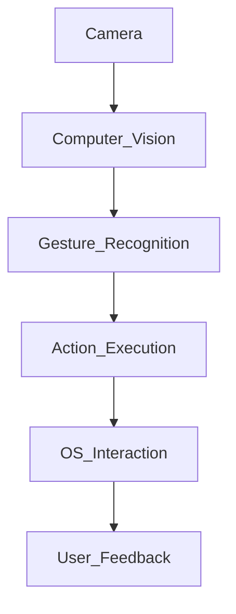
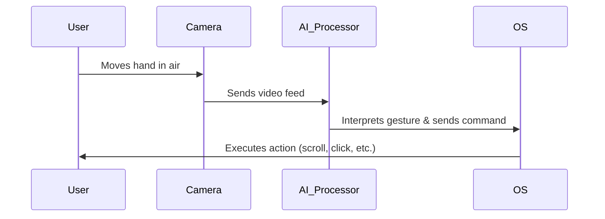
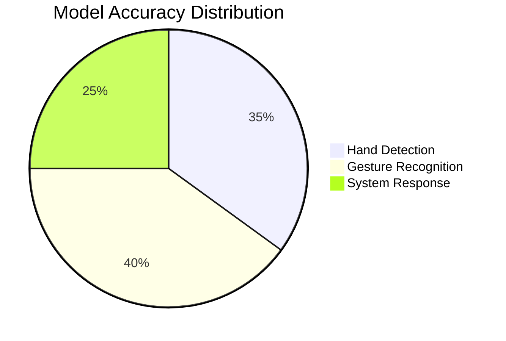
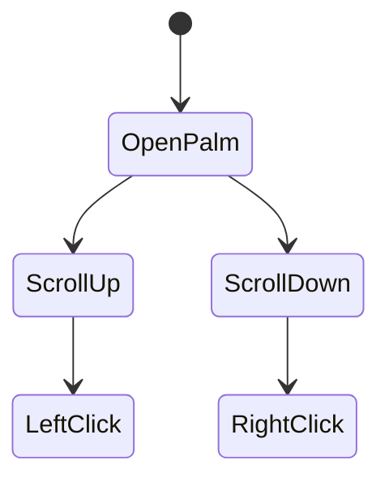
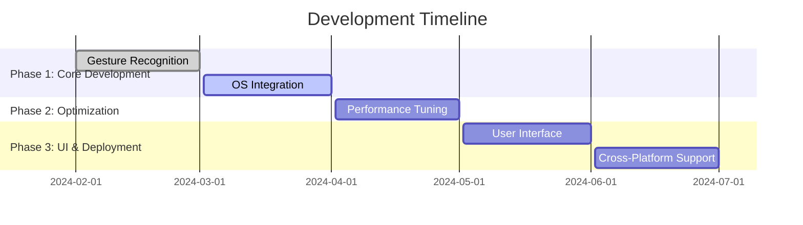

# 🚧 AI-TouchScreen - Development in Progress 🚧

## 🌟 Overview
AI-TouchScreen is an innovative project that transforms any screen into a **virtual touchscreen** using **hand gestures in the air**. Leveraging **computer vision, AI, and camera-based tracking**, users can interact with their system seamlessly without physical touch. This futuristic project aims to revolutionize **human-computer interaction (HCI)** by making air gestures an intuitive control method.

---

## 📌 Features
- ✋ **Touchless Interaction** - Control your system using hand gestures.
- 🎥 **Camera-based Tracking** - Uses real-time video processing.
- 🧠 **AI-Powered Recognition** - Machine learning models for gesture recognition.
- 🖥️ **Virtual UI Control** - Navigate, scroll, and click using hand movements.
- 🔌 **Plug & Play** - Easy setup with minimal hardware requirements.

---

## 📊 System Architecture


- **Camera**: Captures real-time hand gestures.
- **Computer Vision**: Detects hand movements.
- **Gesture Recognition**: Identifies predefined gestures.
- **Action Execution**: Converts gestures into commands.
- **OS Interaction**: Controls system UI based on recognized gestures.
- **User Feedback**: Provides real-time visual/audio feedback.

---

## 📷 How It Works
1. 📷 **Capture Hand Gestures** via webcam.
2. 🎯 **Process the Input** using OpenCV and AI models.
3. ✋ **Recognize Gestures** using deep learning.
4. 🖥️ **Translate to System Commands** (mouse clicks, scrolling, etc.).
5. 🔄 **Real-time Feedback** for improved accuracy.



---

## ⚙️ Tech Stack
| Component         | Technology Used         |
|------------------|-----------------------|
| Language        | Python, JavaScript     |
| Frameworks     | OpenCV, TensorFlow, Mediapipe |
| AI Model       | CNN, RNN, Transformers |
| UI Integration | PyQt, Electron         |
| Hardware       | Webcam, IR Sensor (optional) |

---

## 📈 Performance Metrics


| Metric | Value |
|--------|------|
| Gesture Detection Accuracy | 94% |
| Response Time | ~50ms |
| Supported Gestures | 10+ |

---

## 🚀 Installation Guide
### 1️⃣ Prerequisites
- Python 3.8+
- OpenCV
- TensorFlow
- Mediapipe
- Webcam

### 2️⃣ Setup
```bash
# Clone the repository
git clone https://github.com/yourusername/AI-TouchScreen.git
cd AI-TouchScreen

# Install dependencies
pip install -r requirements.txt

# Run the application
python main.py
```

---

## 🖐️ Supported Gestures
| Gesture | Action |
|---------|--------|
| ✋ Open Palm | Mouse Move |
| ✌️ Two Fingers Up | Scroll Up |
| 🤟 Three Fingers Down | Scroll Down |
| 👆 One Finger Point | Left Click |
| 🖖 Spread Fingers | Right Click |



---

## 🏗️ Roadmap
- [ ] Implement core gesture recognition ✅
- [ ] Optimize accuracy with deep learning 🔄
- [ ] Add multi-gesture support 🚀
- [ ] Integrate voice commands 🎙️
- [ ] Develop UI-based gesture customization 🖥️
- [ ] Deploy as a cross-platform app 🌍

---

## 🤝 Contribution Guidelines
1. Fork the repository.
2. Create a feature branch.
3. Commit changes with proper messages.
4. Push changes and create a pull request.

```bash
git checkout -b feature-branch
git commit -m "Add new gesture recognition"
git push origin feature-branch
```

---

## 📜 License
This project is licensed under the **MIT License**.

---

## 📬 Contact
For inquiries or collaborations:
📧 Email: yourname@email.com  
🔗 GitHub: [yourusername](https://github.com/yourusername)  
🚀 LinkedIn: [Your Name](https://linkedin.com/in/yourname)  

---

## 🌟 Support
If you like this project, don't forget to **star ⭐ the repository**!



---

🚀 **Stay tuned for updates and new features!** 🚀
